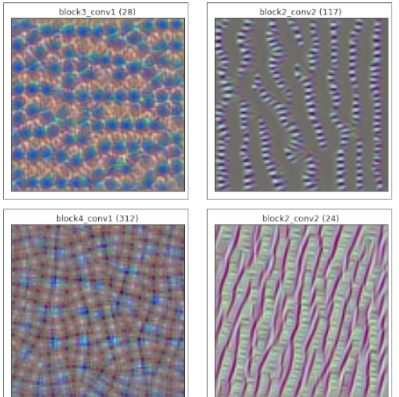

# Visualizing Filters of a CNN using TensorFlow

## Project Overview

Welcome to the **Visualizing Filters of a CNN using TensorFlow** project! In this project, we delve into the world of deep learning and utilize the powerful VGG16 model in combination with TensorFlow to visualize various filters from different layers of the CNN. By employing gradient ascent techniques, we aim to generate images that maximally activate specific filters, giving us insights into the features these filters capture during the learning process.

## Highlights

- **VGG16 Architecture:** We leverage the well-known VGG16 architecture to explore the inner layers and discover the patterns they capture.
- **Filter Activation:** Through gradient ascent, we demonstrate the process of creating images that activate filters from different layers.
- **Unveiling Hidden Features:** Our project reveals intricate features that filters detect, from simple edges to complex textures, shedding light on the model's learning.

## How to Use

1. Clone the repository: `git clone https://github.com/TLILIFIRAS/Visualizing-Filters-of-a-CNN-using-TensorFlow.git `
2. Install required dependencies: `pip install -r requirements.txt`
3. Open and run the Jupyter notebook: `jupyter notebook notebook.ipynb`
4. Dive into the code and experiment with different layers and filters!

## Get in Touch

If you're as passionate about AI, deep learning, and TensorFlow as we are, let's connect! Feel free to reach out for insights, discussions, or to share your thoughts on this project. Let's keep pushing the boundaries of technology together.

Connect with us on LinkedIn:
- [Firas Tlili]([https://www.linkedin.com/in/your-profile-link/](https://www.linkedin.com/in/firastlili/))

## Project Showcase

## License

This project is licensed under the [MIT License](LICENSE).

---
Feel free to contribute, open issues, and explore the fascinating world of CNN filters and visualization!
